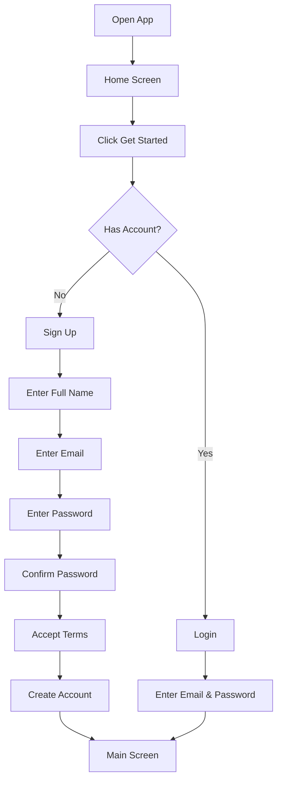
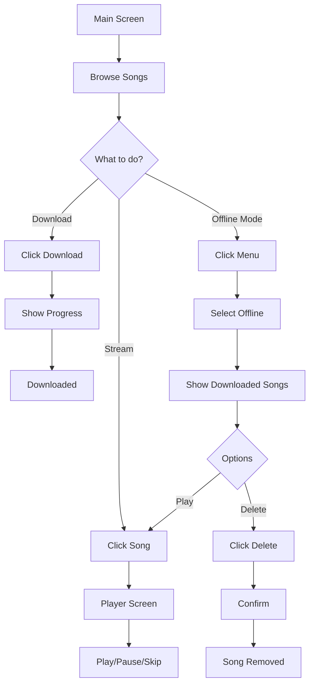

# MusicDM - Music Download Manager


<p align="center">
  <strong>Ứng dụng Android streaming và download nhạc với khả năng phát offline</strong>
</p>

<p align="center">
  
  
  
  
</p>

---

## 📱 Giới thiệu

**MusicDM (Music Download Manager)** là ứng dụng Android cho phép người dùng streaming nhạc trực tuyến, tải về để nghe offline, và quản lý thư viện nhạc cá nhân. Ứng dụng được xây dựng bằng Kotlin với kiến trúc hiện đại, tích hợp Firebase Realtime Database làm backend.

### ✨ Tính năng chính

- 🎵 **Streaming nhạc** từ server Firebase
- 📥 **Download nhạc** với progress tracking
- 🎧 **Phát nhạc offline** từ bộ nhớ local
- 🗑️ **Xóa bài hát** đã tải để giải phóng dung lượng
- 🔀 **Shuffle & Repeat** modes
- 📊 **Waveform visualization** cho music player
- 🔐 **Authentication** với login/signup
- 🌙 **Dark theme** UI hiện đại

---

## 🛠️ Công nghệ sử dụng

### **Core Technologies**

| Technology | Version | Mục đích |
|-----------|---------|----------|
| **Kotlin** | 1.9.0+ | Ngôn ngữ lập trình chính |
| **Android SDK** | Min 26, Target 34 | Platform phát triển |
| **Gradle** | 8.0+ | Build system |

### **Architecture & Components**

- **MVVM Pattern** - Separation of concerns
- **ViewBinding** - Type-safe view access
- **Coroutines + Flow** - Asynchronous operations
- **Lifecycle Components** - Lifecycle-aware components

### **Networking & Storage**

| Library | Version | Mục đích |
|---------|---------|----------|
| **Retrofit** | 2.9.0 | REST API client |
| **OkHttp** | 4.11.0 | HTTP client & logging |
| **Gson** | 2.10.1 | JSON serialization |
| **Room Database** | 2.6.0 | Local SQLite database |

### **Media & UI**

| Library | Version | Mục đích |
|---------|---------|----------|
| **ExoPlayer (Media3)** | 1.2.0 | Audio streaming & playback |
| **Glide** | 4.16.0 | Image loading & caching |
| **Material Components** | 1.11.0 | Material Design UI |
| **SwipeRefreshLayout** | 1.1.0 | Pull-to-refresh |

### **Backend**

- **Firebase Realtime Database** - Cloud database cho danh sách bài hát
- **Firebase Storage** (optional) - Lưu trữ file nhạc

---

## 📋 Yêu cầu hệ thống

### **Development**

- Android Studio Hedgehog | 2023.1.1 trở lên
- JDK 17
- Gradle 8.0+
- Android SDK 34
- Emulator hoặc thiết bị thật với API level 26+

### **Runtime**

- **Minimum SDK:** API 26 (Android 8.0 Oreo)
- **Target SDK:** API 34 (Android 14)
- **RAM:** Tối thiểu 2GB
- **Storage:** 100MB+ (tùy số lượng bài hát tải)
- **Internet:** Cần kết nối để streaming (không cần cho offline mode)

---

## 🏗️ Kiến trúc ứng dụng

```
┌─────────────────────────────────────────┐
│           Presentation Layer            │
│  ┌─────────────┐  ┌──────────────────┐ │
│  │ Activities  │  │  Adapters/Views  │ │
│  │ (UI Logic)  │  │  (RecyclerView)  │ │
│  └─────────────┘  └──────────────────┘ │
└─────────────────────────────────────────┘
                    │
                    ▼
┌─────────────────────────────────────────┐
│            Domain Layer                 │
│  ┌─────────────┐  ┌──────────────────┐ │
│  │   Models    │  │   Use Cases      │ │
│  │ (Data class)│  │  (Business Logic)│ │
│  └─────────────┘  └──────────────────┘ │
└─────────────────────────────────────────┘
                    │
                    ▼
┌─────────────────────────────────────────┐
│             Data Layer                  │
│  ┌──────────────┐  ┌─────────────────┐ │
│  │ Room Database│  │  API Service    │ │
│  │   (Local)    │  │   (Remote)      │ │
│  └──────────────┘  └─────────────────┘ │
│  ┌──────────────┐  ┌─────────────────┐ │
│  │ UserManager  │  │ DownloadManager │ │
│  │(SharedPrefs) │  │  (File I/O)     │ │
│  └──────────────┘  └─────────────────┘ │
└─────────────────────────────────────────┘
```

---

## 📁 Cấu trúc thư mục

```
com.hust.musicdm/
├── activity/              # UI Activities
│   ├── HomeActivity.kt
│   ├── LoginActivity.kt
│   ├── SignUpActivity.kt
│   ├── MainActivity.kt
│   └── PlayerActivity.kt
├── adapter/               # RecyclerView Adapters
│   └── SongAdapter.kt
├── api/                   # Network layer
│   ├── ApiService.kt
│   ├── RetrofitClient.kt
│   └── DownloadManager.kt
├── database/              # Local database
│   ├── SongDao.kt
│   ├── SongEntity.kt
│   ├── SongDatabase.kt
│   └── UserManager.kt
├── model/                 # Data models
│   ├── Song.kt
│   └── User.kt
└── view/                  # Custom views
    └── WaveformView.kt
```

---

## 🔄 Task Flow

### **1. Authentication Flow**

```
Start App
    ↓
HomeActivity (Splash Screen)
    ↓
Check if logged in?
    ├─ Yes → MainActivity
    └─ No  → LoginActivity
              ├─ Sign In → MainActivity
              └─ Sign Up → SignUpActivity → LoginActivity
```

### **2. Music Streaming Flow**

```
MainActivity
    ↓
Load songs from API
    ↓
Display in RecyclerView
    ↓
User clicks song
    ↓
PlayerActivity
    ├─ Stream from URL (if online)
    └─ Play from local file (if downloaded)
```

### **3. Download Flow**

```
MainActivity
    ↓
User clicks download button
    ↓
DownloadManager starts download
    ↓
Show progress (0% → 100%)
    ↓
Save file to internal storage
    ↓
Update Room Database
    ├─ isDownloaded = true
    └─ localPath = "/data/.../music/{id}_{title}.mp3"
    ↓
Update UI (show delete icon)
```

### **4. Delete Flow**

```
MainActivity (Offline Mode)
    ↓
User clicks delete button
    ↓
Show confirmation dialog
    ↓
User confirms
    ↓
Delete file from storage
    ↓
Update Room Database
    ├─ isDownloaded = false
    └─ localPath = null
    ↓
Update UI (show download icon)
```

---

## 👤 User Flow

### **First Time User**



### **Main User Journey**



---

## 🚀 Cài đặt & Chạy

### **Bước 1: Clone repository**

```bash
git clone https://github.com/yourusername/MusicDM.git
cd MusicDM
```

### **Bước 2: Cấu hình Firebase**

1. Tạo project trên [Firebase Console](https://console.firebase.google.com/)
2. Thêm Android app với package name: `com.hust.musicdm`
3. Download `google-services.json`
4. Copy vào thư mục `app/`
5. Tạo Realtime Database với structure:

```json
{
  "songs": [
    {
      "id": 1,
      "title": "Song Title",
      "artist": "Artist Name",
      "streamUrl": "https://example.com/stream.mp3",
      "downloadUrl": "https://example.com/download.mp3",
      "albumArt": "https://example.com/cover.jpg",
      "duration": 240000
    }
  ]
}
```

### **Bước 3: Update Base URL**

Mở `RetrofitClient.kt` và cập nhật:

```kotlin
private const val BASE_URL = "https://YOUR-PROJECT-ID-default-rtdb.firebaseio.com/"
```

### **Bước 4: Build & Run**

```bash
# Sync Gradle
./gradlew build

# Install on device
./gradlew installDebug

# Or run from Android Studio
# Click Run ▶️ button
```

---

## 📱 Screenshots

<table>
  <tr>
    <td><br/><sub>Home Screen</sub></td>
    <td><br/><sub>Signup</sub></td>
    <td><br/><sub>Login</sub></td>
    <td><br/><sub>Main Screen</sub></td>
    <td><br/><sub>Player</sub></td>
  </tr>
</table>

---

## 🗄️ Database Schema

### **Room Database: music_database**

#### **Table: songs**

| Column | Type | Description |
|--------|------|-------------|
| `id` | LONG | Primary Key |
| `title` | TEXT | Tên bài hát |
| `artist` | TEXT | Tên nghệ sĩ |
| `streamUrl` | TEXT | URL streaming |
| `downloadUrl` | TEXT | URL download |
| `albumArt` | TEXT | URL ảnh bìa |
| `duration` | LONG | Thời lượng (ms) |
| `isDownloaded` | BOOLEAN | Đã tải hay chưa |
| `localPath` | TEXT | Đường dẫn file local |
| `downloadedAt` | LONG | Timestamp tải xuống |

### **SharedPreferences: MusicDM_Prefs**

```json
{
  "user": "{User JSON}",
  "is_logged_in": true,
  "users_database": "{Map<Email, UserCredential>}",
  "last_activity_time": 1705190348000
}
```

---

## 🔐 Security & Privacy

### **User Authentication**

- ⚠️ **Current:** Mật khẩu lưu plain text trong SharedPreferences
- ✅ **Recommendation:** Implement proper encryption hoặc Firebase Authentication

### **Data Storage**

- **Songs:** Lưu trong internal storage (`/data/data/com.hust.musicdm/files/music/`)
- **User Data:** SharedPreferences (private mode)
- **Database:** Room Database (SQLite encrypted recommended)

### **Network Security**

- HTTPS required cho tất cả API calls
- OkHttp với certificate pinning (recommended)

---

## 🐛 Known Issues & Limitations

### **Current Limitations**

1. **Offline API Fetch:**
   - Khi không có internet lần đầu, không load được danh sách
   - **Fix:** App hiện load từ Database khi offline

2. **User Authentication:**
   - Password không được encrypt
   - **Recommendation:** Dùng Firebase Auth hoặc encrypt password

3. **Download Management:**
   - Không có pause/resume download
   - **Future:** Implement WorkManager cho background download

4. **Storage Management:**
   - Không có tự động xóa khi hết dung lượng
   - **Future:** Thêm storage quota management

### **Device Requirements**

- Database Inspector chỉ hoạt động với API 26+
- ExoPlayer yêu cầu codec hỗ trợ MP3
- Minimum 100MB free storage recommended

---

## 📈 Performance Optimization

### **Implemented**

- ✅ ViewBinding (thay vì findViewById)
- ✅ DiffUtil cho RecyclerView
- ✅ Glide caching cho images
- ✅ Coroutines cho async operations
- ✅ Room Database caching

### **Future Improvements**

- [ ] Implement ViewModel
- [ ] Add Dependency Injection (Hilt/Koin)
- [ ] Pagination cho large playlists
- [ ] Image placeholder optimization
- [ ] Prefetch next song trong playlist

---

## 🧪 Testing

### **Manual Testing Checklist**

- [ ] Login/Signup flows
- [ ] Song streaming
- [ ] Download với progress tracking
- [ ] Delete downloaded songs
- [ ] Offline mode display
- [ ] Player controls (play/pause/skip)
- [ ] Shuffle/Repeat modes
- [ ] Waveform seek
- [ ] App lifecycle (background/foreground)

### **Future: Unit Tests**

```kotlin
// Example test structure (not implemented yet)
class SongRepositoryTest { }
class DownloadManagerTest { }
class UserManagerTest { }
```

---

## 📝 API Documentation

### **Endpoint: Get Songs**

```
GET https://YOUR-PROJECT-ID-default-rtdb.firebaseio.com/songs.json
```

**Response:**

```json
[
  {
    "id": 1,
    "title": "Song Title",
    "artist": "Artist Name",
    "streamUrl": "https://example.com/stream.mp3",
    "downloadUrl": "https://example.com/download.mp3",
    "albumArt": "https://example.com/cover.jpg",
    "duration": 240000
  }
]
```

### **Endpoint: Download File**

```
GET {song.downloadUrl}
Streaming: true
```

---

## 🤝 Contributing

Contributions are welcome! Để đóng góp:

1. Fork repository
2. Create feature branch (`git checkout -b feature/AmazingFeature`)
3. Commit changes (`git commit -m 'Add some AmazingFeature'`)
4. Push to branch (`git push origin feature/AmazingFeature`)
5. Open Pull Request

### **Coding Standards**

- Follow Kotlin coding conventions
- Use meaningful variable/function names
- Add comments for complex logic
- Write unit tests for new features

---

## 📄 License

```
Copyright 2026 MusicDM

Licensed under the Apache License, Version 2.0 (the "License");
you may not use this file except in compliance with the License.
You may obtain a copy of the License at

    http://www.apache.org/licenses/LICENSE-2.0

Unless required by applicable law or agreed to in writing, software
distributed under the License is distributed on an "AS IS" BASIS,
WITHOUT WARRANTIES OR CONDITIONS OF ANY KIND, either express or implied.
See the License for the specific language governing permissions and
limitations under the License.
```

---

## 👨‍💻 Author

**Your Name**
- GitHub: [@MaiVanDang](https://github.com/MaiVanDang)
- Email: dangmaivan24@gmail.com
- University: HUST (Hanoi University of Science and Technology)

---

## 🙏 Acknowledgments

- [ExoPlayer](https://github.com/google/ExoPlayer) - Media playback
- [Retrofit](https://square.github.io/retrofit/) - Networking
- [Glide](https://github.com/bumptech/glide) - Image loading
- [Material Design](https://material.io/) - UI components
- Firebase team for Realtime Database

---

## 📞 Support

Nếu có vấn đề hoặc câu hỏi:

1. Check [Issues](https://github.com/MaiVanDang/MusicDM/issues) page
2. Open new issue với detailed description
3. Email: dangmaivan24@gmail.com

---

<p align="center">Made with ❤️ for HUST Mobile Development Course</p>
<p align="center">⭐ Star this repo if you find it helpful!</p>
